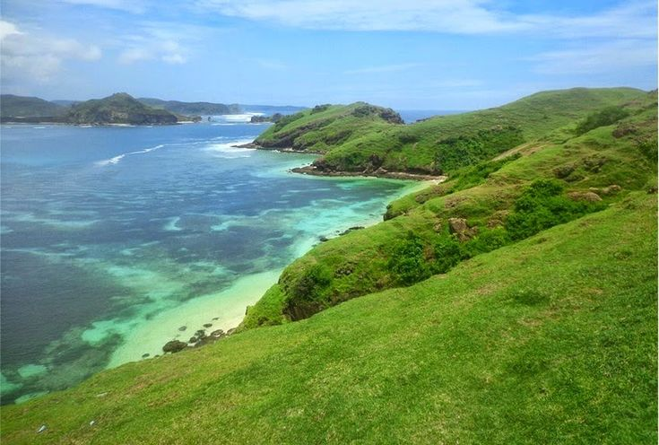

<div align="center">

  <div style="
      width: 100%;
      max-width: 900px;
      height: 280px; 
      margin: 0 auto 30px auto;
      overflow: hidden;
      border-radius: 16px;
      box-shadow: 0 8px 20px rgba(18, 105, 152, 0.2);
      position: relative;
  ">

  </div>

  <a href="https://git.io/typing-svg">
    
  </a>

  <p align="center">
    <b>Website Pariwisata & Panduan Perjalanan Pulau Lombok</b><br>
    <i>Project Akhir Mata Kuliah Pemrograman Web - Kelompok 9</i>
  </p>

  <p>
    
    
    
    
  </p>

  <br>
</div>

---

## 🌴 Tentang Project

**Lombok Explore** adalah platform web interaktif yang didedikasikan untuk memperkenalkan keindahan alam, budaya, dan destinasi tersembunyi di Pulau Lombok. Website ini dirancang dengan antarmuka modern yang memadukan estetika tropis dengan pengalaman pengguna yang mulus (*smooth user experience*).

Project ini dibuat sebagai pemenuhan tugas akhir mata kuliah **Pemrograman Web** untuk mendemonstrasikan kemampuan dalam membangun antarmuka web yang responsif dan dinamis.

## ✨ Fitur & Struktur Halaman

Website ini terdiri dari 4 halaman utama yang saling terintegrasi dengan fitur-fitur menarik:

### 1. 🏠 Beranda (Home)
Halaman depan yang menyambut pengunjung dengan visual memukau.
* **Hero Slider Interaktif:** Menampilkan highlight destinasi unggulan dengan efek transisi kartu yang halus.
* **Informasi Real-time:** Menampilkan jam WIB terkini dan statistik pengunjung secara dinamis.
* **Scroll Reveal:** Elemen visual muncul perlahan saat pengguna menggulir halaman ke bawah.

### 2. ℹ️ Tentang Destinasi (About)
Panduan lengkap bagi wisatawan yang ingin merencanakan perjalanan.
* **Detail 6 Destinasi Ikonik:** Mulai dari Bukit Merese hingga Air Terjun Tiu Kelep.
* **Informasi Praktis:** Menyajikan info Harga Tiket Masuk (HTM), Jam Operasional, dan Fasilitas.
* **Direct Maps:** Tombol khusus yang langsung mengarahkan pengguna ke lokasi via Google Maps.

### 3. 🖼️ Galeri Visual (Gallery)
Pengalaman visual yang memanjakan mata dengan tata letak modern.
* **Grid Layout Futuristik:** Penataan foto yang responsif dan rapi.
* **Hover Effects:** Efek overlay gelap dan judul lokasi yang muncul saat kursor diarahkan ke foto.
* **High Quality Assets:** Kumpulan foto-foto terbaik dari keindahan alam Lombok.

### 4. 📞 Kontak (Contact)
Pusat informasi dan layanan komunikasi.
* **Direct WhatsApp:** Formulir kritik dan saran yang terhubung langsung ke API WhatsApp Admin tanpa menyimpan kontak manual.
* **Info Admin:** Menampilkan kontak email dan media sosial pengelola.

## 👥 Anggota Kelompok 9

Kami adalah tim yang berdedikasi di balik pengembangan Lombok Explore:

| No | Nama Anggota | NIM | Role |
| :---: | :--- | :---: | :--- |
| 1. | **Wahyu Maulana Ishaq** | `243200317` | *Frontend Developer * |
| 2. | **Aulia Dinda Puspita** | `243200327` | *frontend developer* |
| 3. | **Aziz Almubasir** |  | *Frontend Developer* |
| 4. | **Qorin Nur Fauzi** |  | *frontend developer* |
| 5. | **Aulia Khairani** | | *frontend Developer* |


---

## 📸 Tampilan Antarmuka (Preview)

Berikut adalah sekilas tampilan dari website Lombok Explore.

| **Halaman Utama (Hero)** | **Destinasi Slider** |
| :---: | :---: |
|  |  |

| **Galeri Visual** | **Halaman Kontak** |
| :---: | :---: |
|  | *Formulir reservasi responsif* |

---

## 📂 Struktur Folder

Struktur direktori project ini disusun agar rapi dan mudah dikelola:

```bash
project-pweb-pulau-lombok/
│
├── 📄 index.html        # Halaman Utama (Beranda)
├── 📄 about.html        # Halaman Detail Destinasi
├── 📄 gallery.html      # Halaman Galeri Foto
├── 📄 contact.html      # Halaman Kontak & Form
├── 📄 script.js         # Logika JavaScript (Slider, Jam, Animasi)
│
└── 📂 assets/
    ├── 📂 css/
    │   └── 📄 style.css      # Styling utama (Variables, Animations)
    │
    └── 📂 images/
        ├── 📂 Slides/        # Gambar untuk slider
        ├── bg index.jpg      # Background utama
        ├── noise-texture.png # Aset tekstur
        └── ... (Aset gambar lainnya)
